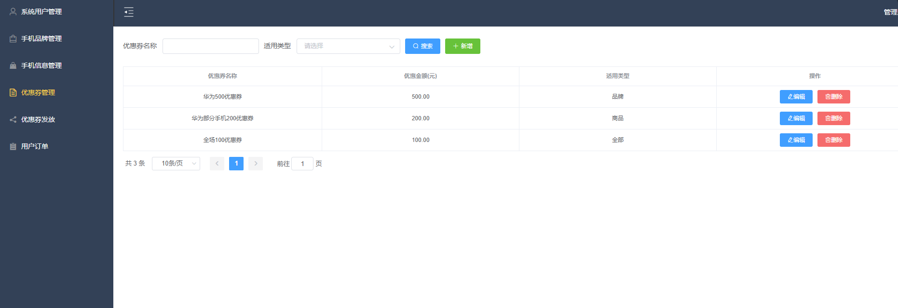

# 1 项目介绍
基于SSM+Vue的手机商城系统：后端 SpringBoot、Mybatis-Plus，前端Vue+ElementUI，具体功能如下：
## 管理端
- 手机品牌管理
- 手机管理
- 优惠券管理
- 优惠券发放
- 订单管理
- 用户管理
## 用户端
- 浏览手机列表
- 查看手机详情
- 购买手机
- 我的订单
- 订单评价
- 个人中心
# 2 系统运行截图
## 2.1 用户登录

## 2.2 手机信息管理

## 2.3 优惠券管理

## 2.4 订单管理

## 2.5 商品列表

## 2.6 商品详情

## 2.7 订单列表

## 2.8 订单详情

## 2.9 万字文档

# 3 数据库设计

# 4 源码数据库获取(收费)

